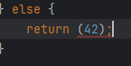
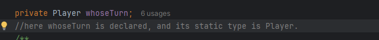

# Answers to Lab Questions

Place here your answers to the reflection questions in the lab instructions.

## Question 1
Why *can* you change the type of the returned **value** in `promptForPlayer` without changing the return **type** in the function signature?
### Answer
This works because of subtype polymorphism - a HumanPlayer instance is also a Player instance through inheritance, and can be treated as such. From what I understand this is one of the reasons subtype polymorphism is so useful. 
If I replace HumanPlayer with another value to be returned, the compiler does not let that slide! Yay for polymorphism!

## Question 2
Explain why the call to `getNextMove` initially causes an error until you add the abstract method to the `Player` class. Your answer should involve a discussion of static (compile-time) vs dynamic (run-time) types. (HINT: What is the compile-time vs run-time type of the `player` variable in `TicTacToeGame.doNextTurn`?)
### Answer 

the variable player's static type, shown above, restricts what methods may be called on it. The runtime type of the player variable is HumanPlayer(the only instantiation of Player
in the program so far), but when the compiler checks for a getNextMove method in the Player class, there's nothing there! What a bummer. Good thing abstract methods and overriding are a thing. 

## Question 3
Explain in detail how it is possible that neither our main game loop nor our TicTacToeGame class need change at all when adding new Player types to our game.  Your discussion must include an explanation of how the single call to getNextMove in TicTacToeGame.doNextTurn works correctly no matter whose turn it is or which types the players are. Your answer should involve discussion of polymorphism and dynamic method dispatch.

### Answer
Your answer [here]()

